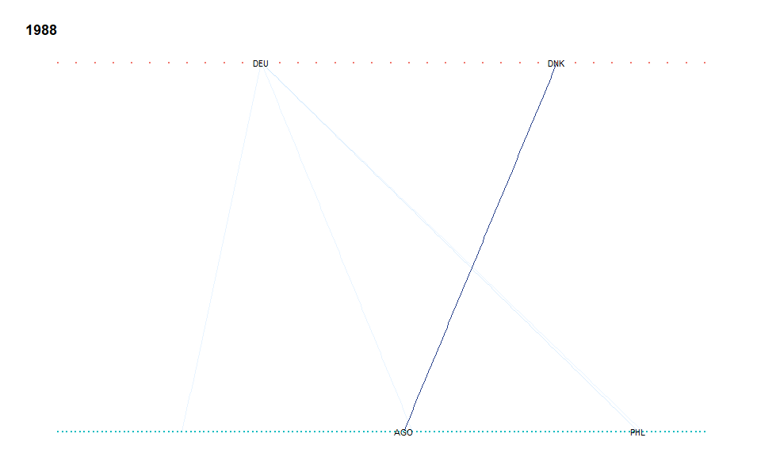

Descriptive\_Statistics
================
SaewonPark
October 6, 2018

### About the data

Unit of analysis: dyad-years

donor countries: 35 countries

recipient countries: 129 countries

time period: 1991-2014

<table style="text-align:center">

<caption>

<strong>Descriptive Statistics, 1991 - 2014</strong>

</caption>

<tr>

<td colspan="8" style="border-bottom: 1px solid black">

</td>

</tr>

<tr>

<td style="text-align:left">

Statistic

</td>

<td>

N

</td>

<td>

Mean

</td>

<td>

St. Dev.

</td>

<td>

Min

</td>

<td>

Pctl(25)

</td>

<td>

Pctl(75)

</td>

<td>

Max

</td>

</tr>

<tr>

<td colspan="8" style="border-bottom: 1px solid black">

</td>

</tr>

<tr>

<td style="text-align:left">

Aidflow (per 1000, logged)

</td>

<td>

18,895

</td>

<td>

3.372

</td>

<td>

2.107

</td>

<td>

\-6.326

</td>

<td>

1.642

</td>

<td>

4.961

</td>

<td>

11.193

</td>

</tr>

<tr>

<td style="text-align:left">

Ideal Point Difference

</td>

<td>

18,778

</td>

<td>

1.695

</td>

<td>

0.760

</td>

<td>

0.000

</td>

<td>

1.262

</td>

<td>

2.114

</td>

<td>

4.608

</td>

</tr>

<tr>

<td style="text-align:left">

\<U+0394\> Ideal Point Difference

</td>

<td>

18,766

</td>

<td>

\-0.003

</td>

<td>

0.159

</td>

<td>

\-1.345

</td>

<td>

\-0.083

</td>

<td>

0.082

</td>

<td>

1.126

</td>

</tr>

<tr>

<td style="text-align:left">

Conflict, Prior Year, R

</td>

<td>

18,510

</td>

<td>

0.223

</td>

<td>

0.417

</td>

<td>

0.000

</td>

<td>

0.000

</td>

<td>

0.000

</td>

<td>

1.000

</td>

</tr>

<tr>

<td style="text-align:left">

Democratization (ord), R

</td>

<td>

17,507

</td>

<td>

0.286

</td>

<td>

2.105

</td>

<td>

\-14.000

</td>

<td>

0.000

</td>

<td>

0.000

</td>

<td>

16.000

</td>

</tr>

<tr>

<td style="text-align:left">

Democratization (dummy), R

</td>

<td>

17,507

</td>

<td>

0.067

</td>

<td>

0.249

</td>

<td>

0.000

</td>

<td>

0.000

</td>

<td>

0.000

</td>

<td>

1.000

</td>

</tr>

<tr>

<td style="text-align:left">

Democracy (ord), R

</td>

<td>

17,560

</td>

<td>

3.186

</td>

<td>

5.610

</td>

<td>

\-10.000

</td>

<td>

\-2.000

</td>

<td>

8.000

</td>

<td>

10.000

</td>

</tr>

<tr>

<td style="text-align:left">

GDP growth, R

</td>

<td>

18,895

</td>

<td>

4.750

</td>

<td>

8.705

</td>

<td>

\-39.240

</td>

<td>

0.812

</td>

<td>

7.955

</td>

<td>

93.775

</td>

</tr>

<tr>

<td style="text-align:left">

GDP growth, D

</td>

<td>

18,894

</td>

<td>

1.908

</td>

<td>

3.185

</td>

<td>

\-24.395

</td>

<td>

0.490

</td>

<td>

3.886

</td>

<td>

19.385

</td>

</tr>

<tr>

<td style="text-align:left">

GDP (logged), R

</td>

<td>

18,895

</td>

<td>

8.322

</td>

<td>

0.952

</td>

<td>

4.997

</td>

<td>

7.574

</td>

<td>

9.110

</td>

<td>

10.813

</td>

</tr>

<tr>

<td style="text-align:left">

GDP (logged), D

</td>

<td>

18,894

</td>

<td>

10.585

</td>

<td>

0.211

</td>

<td>

9.776

</td>

<td>

10.453

</td>

<td>

10.684

</td>

<td>

11.463

</td>

</tr>

<tr>

<td style="text-align:left">

Population (logged), R

</td>

<td>

18,895

</td>

<td>

9.611

</td>

<td>

1.643

</td>

<td>

3.793

</td>

<td>

8.593

</td>

<td>

10.632

</td>

<td>

14.130

</td>

</tr>

<tr>

<td style="text-align:left">

Population (logged), D

</td>

<td>

18,894

</td>

<td>

10.124

</td>

<td>

1.336

</td>

<td>

5.772

</td>

<td>

9.039

</td>

<td>

11.064

</td>

<td>

12.674

</td>

</tr>

<tr>

<td style="text-align:left">

Women in Parliament (%), D

</td>

<td>

18,894

</td>

<td>

26.726

</td>

<td>

11.008

</td>

<td>

1.500

</td>

<td>

17.900

</td>

<td>

36.600

</td>

<td>

47.300

</td>

</tr>

<tr>

<td style="text-align:left">

Common Official Lang.

</td>

<td>

18,579

</td>

<td>

0.168

</td>

<td>

0.374

</td>

<td>

0.000

</td>

<td>

0.000

</td>

<td>

0.000

</td>

<td>

1.000

</td>

</tr>

<tr>

<td style="text-align:left">

Past Colonial Relationship

</td>

<td>

18,579

</td>

<td>

0.076

</td>

<td>

0.264

</td>

<td>

0.000

</td>

<td>

0.000

</td>

<td>

0.000

</td>

<td>

1.000

</td>

</tr>

<tr>

<td style="text-align:left">

Distance (km, logged)

</td>

<td>

18,579

</td>

<td>

8.748

</td>

<td>

0.617

</td>

<td>

4.765

</td>

<td>

8.456

</td>

<td>

9.167

</td>

<td>

9.885

</td>

</tr>

<tr>

<td style="text-align:left">

\# of PTAs

</td>

<td>

16,588

</td>

<td>

0.014

</td>

<td>

0.117

</td>

<td>

0.000

</td>

<td>

0.000

</td>

<td>

0.000

</td>

<td>

1.000

</td>

</tr>

<tr>

<td style="text-align:left">

Military Intervention (dummy)

</td>

<td>

16,588

</td>

<td>

0.002

</td>

<td>

0.041

</td>

<td>

0.000

</td>

<td>

0.000

</td>

<td>

0.000

</td>

<td>

1.000

</td>

</tr>

<tr>

<td style="text-align:left">

Unemployment Rate, R

</td>

<td>

18,656

</td>

<td>

8.483

</td>

<td>

6.784

</td>

<td>

0.160

</td>

<td>

3.735

</td>

<td>

11.193

</td>

<td>

44.157

</td>

</tr>

<tr>

<td style="text-align:left">

Unemployment Rate, D

</td>

<td>

18,771

</td>

<td>

7.027

</td>

<td>

3.351

</td>

<td>

1.640

</td>

<td>

4.620

</td>

<td>

8.390

</td>

<td>

27.470

</td>

</tr>

<tr>

<td style="text-align:left">

Unemployment Difference

</td>

<td>

18,656

</td>

<td>

\-1.450

</td>

<td>

7.556

</td>

<td>

\-37.957

</td>

<td>

\-4.853

</td>

<td>

3.289

</td>

<td>

25.770

</td>

</tr>

<tr>

<td style="text-align:left">

Immigration (logged), R to D

</td>

<td>

15,207

</td>

<td>

5.153

</td>

<td>

2.430

</td>

<td>

0.000

</td>

<td>

3.434

</td>

<td>

6.876

</td>

<td>

12.155

</td>

</tr>

<tr>

<td style="text-align:left">

Export (logged), R to D

</td>

<td>

15,635

</td>

<td>

16.846

</td>

<td>

3.611

</td>

<td>

0.000

</td>

<td>

14.721

</td>

<td>

19.395

</td>

<td>

26.634

</td>

</tr>

<tr>

<td style="text-align:left">

Export (logged), D to R

</td>

<td>

16,524

</td>

<td>

17.885

</td>

<td>

2.508

</td>

<td>

5.220

</td>

<td>

16.309

</td>

<td>

19.546

</td>

<td>

26.144

</td>

</tr>

<tr>

<td colspan="8" style="border-bottom: 1px solid black">

</td>

</tr>

</table>

   

### Democracy aidflow (1988-2016) as a bilateral network

